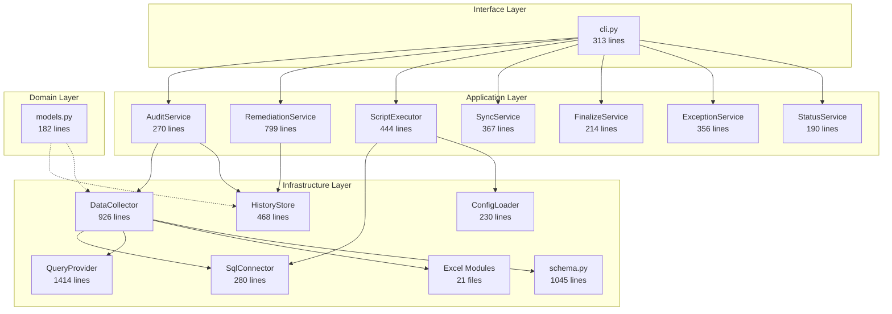
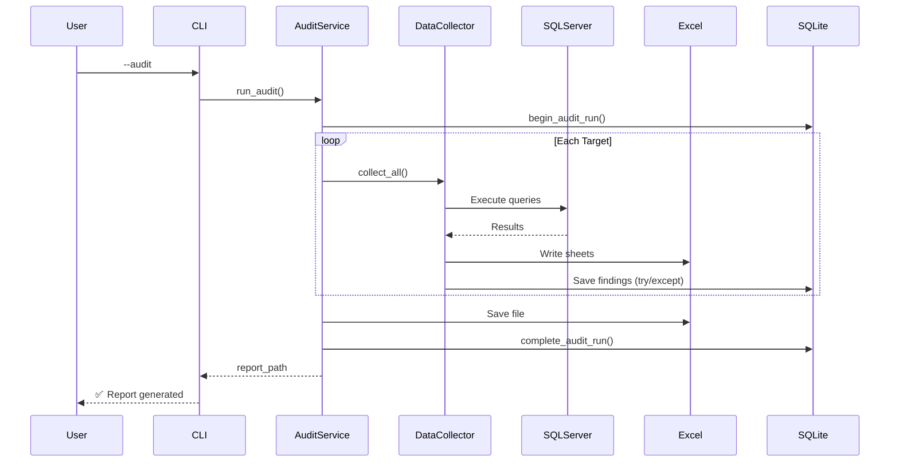

# AutoDBAudit Architecture Walkthrough

> **Created**: 2025-12-11 | **Purpose**: Document codebase architecture after comprehensive review

## High-Level Architecture

## Layer Responsibilities

| Layer | Purpose | Key Files |
|-------|---------|-----------|
| **Interface** | CLI parsing, command routing | `cli.py` |
| **Application** | Business logic, orchestration | `*_service.py` |
| **Infrastructure** | I/O, persistence, external systems | `sql/`, `sqlite/`, `excel/` |
| **Domain** | Pure data models | `models.py` |

---

## Key Design Patterns

### 1. Strategy Pattern - Query Provider
SQL queries vary by SQL Server version. `QueryProvider` uses strategy pattern:
- `Sql2008Provider` - FOR XML PATH, no STRING_AGG
- `Sql2019PlusProvider` - Modern DMVs, STRING_AGG
- Factory function `get_query_provider(version_major)` selects appropriate strategy

### 2. Layered Architecture
Clean separation prevents coupling:
- Domain has no dependencies
- Infrastructure only depends on Domain
- Application depends on Infrastructure + Domain
- Interface only calls Application

### 3. Modular Excel Sheets
Each Excel sheet is a separate module in `excel/`:
- `logins.py`, `databases.py`, `config.py`, etc.
- `writer.py` coordinates all sheets
- Easy to add new sheets

---

## Data Flow: Audit Command

---

## File Statistics

| Directory | Files | Lines | Purpose |
|-----------|-------|-------|---------|
| `application/` | 10 | ~3,900 | Business services |
| `infrastructure/sql/` | 3 | ~1,700 | SQL connectivity |
| `infrastructure/sqlite/` | 3 | ~1,500 | SQLite persistence |
| `infrastructure/excel/` | 21 | ~6,500 | Report generation |
| `domain/` | 2 | ~200 | Data models |
| `hotfix/` | 5 | ~800 | Stubs only |

**Total Source**: ~14,600 lines across 44 Python files

---

## Known Issues Found

### Schema Mismatches
See [SCHEMA_ALIGNMENT_ANALYSIS.md](file:///c:/Users/sickp/source/SQLAuditProject/AutoDBAudit/docs/SCHEMA_ALIGNMENT_ANALYSIS.md)
- `save_database()` uses columns not in table
- `save_linked_server()` uses columns not in table
- `save_backup_record()` uses columns not in table

### Hotfix Module
- All methods raise `NotImplementedError`
- Config file `hotfix_mapping.json` doesn't exist
- Designed but not implemented

---

## Quality Assessment

| Aspect | Rating | Notes |
|--------|--------|-------|
| Architecture | ⭐⭐⭐⭐⭐ | Clean layered design, DDD principles |
| Documentation | ⭐⭐⭐⭐ | Good docstrings, some outdated docs |
| Code Quality | ⭐⭐⭐⭐ | Consistent style, type hints |
| Test Coverage | ⭐⭐ | Limited, needs more automated tests |
| Error Handling | ⭐⭐⭐ | Present but could be more robust |

---

*Generated by comprehensive codebase review*
