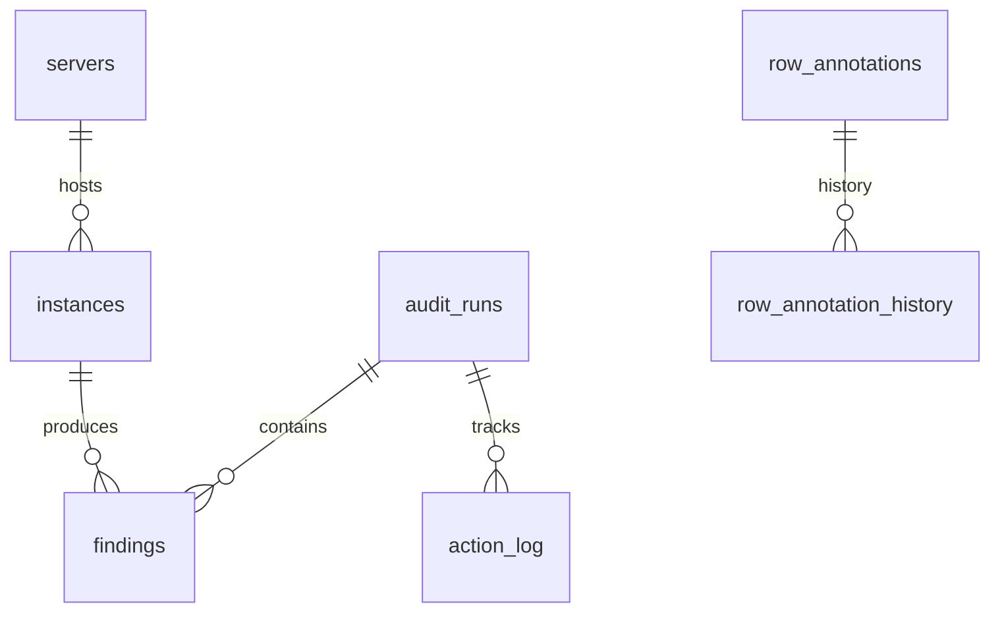

# SQLite Database Schema

**File**: `output/audit_history.db`
**Source Code**: `src/autodbaudit/infrastructure/sqlite/schema.py`

This database persists the entire audit history and configuration.

## Core Tables

### `audit_runs`
| Column | Type | Description |
| :--- | :--- | :--- |
| `id` | INTEGER PK | Auto-incrementing Run ID. |
| `started_at` | TEXT | ISO8601 Timestamp. |
| `status` | TEXT | `running`, `completed`, `failed`, `finalized`. |
| `run_type` | TEXT | `audit`, `sync`, `finalize`. |

### `findings`
Stores the raw technical results of a scan.
| Column | Type | Description |
| :--- | :--- | :--- |
| `id` | INTEGER PK | |
| `audit_run_id` | FK | Link to run. |
| `entity_key` | TEXT | `Server|Instance|EntityName` (Composite Key). |
| `finding_type` | TEXT | `login`, `config`, etc. |
| `status` | TEXT | `PASS`, `FAIL`, `WARN`. |
| `details` | JSON | Extended data (e.g., config values). |

### `action_log`
Records the history of remediation/changes.
| Column | Type | Description |
| :--- | :--- | :--- |
| `action_date` | TEXT | Real-world time of detection. |
| `action_type` | TEXT | `fixed`, `regression`, `new`, `exception`. |
| `description` | TEXT | Human-readable specific change. |

---

## Annotation System (The "User Truth")

### `row_annotations` (v3 Schema)
This is the **primary** storage for user inputs, keyed by the stable Excel UUID.

| Column | Type | Description |
| :--- | :--- | :--- |
| `row_uuid` | TEXT (8) | **Primary Key**. 8-char Hex from Excel Column A. |
| `sheet_name` | TEXT | Origin sheet. |
| `entity_key` | TEXT | Legacy key backup. |
| `review_status`| TEXT | `✓ Exception`, `⏳ Needs Review`. |
| `justification`| TEXT | Exception reason. |
| `notes` | TEXT | General notes. |
| `status` | TEXT | `active`, `resolved` (row deleted), `orphaned`. |

**Why UUID?**
The `entity_key` (e.g., "Server|User") is unstable if a server is renamed or a user changes. The `row_uuid` is generated once in Excel and never changes, ensuring comments stick to the row even if data changes.

### `row_annotation_history`
Audit trail of *who* changed *what* annotation and *when*.

---

## Relationships

